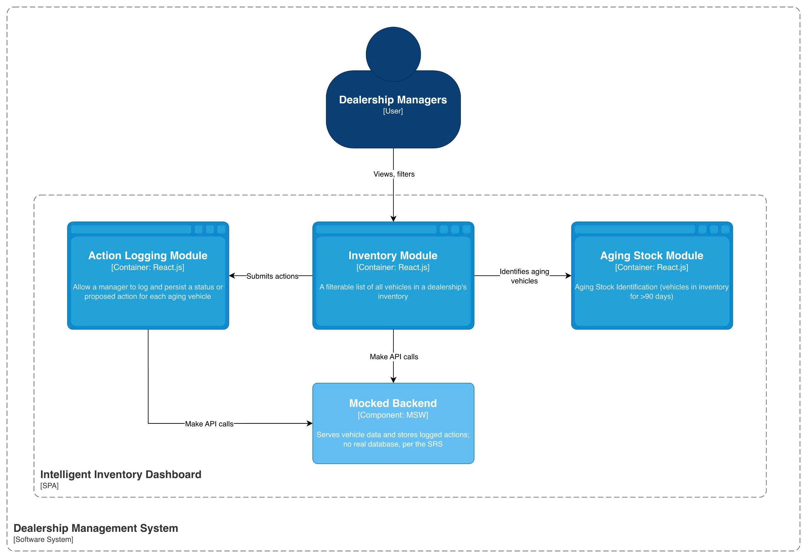
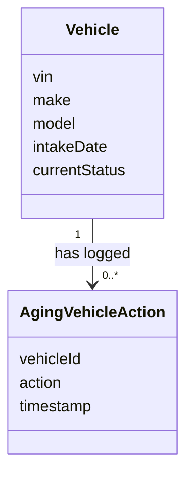
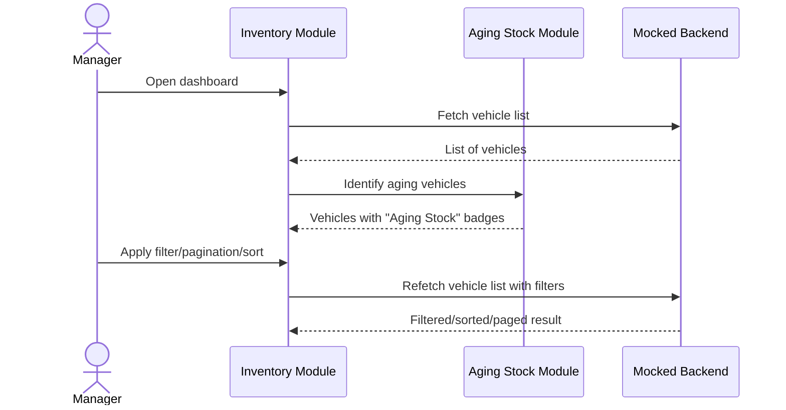
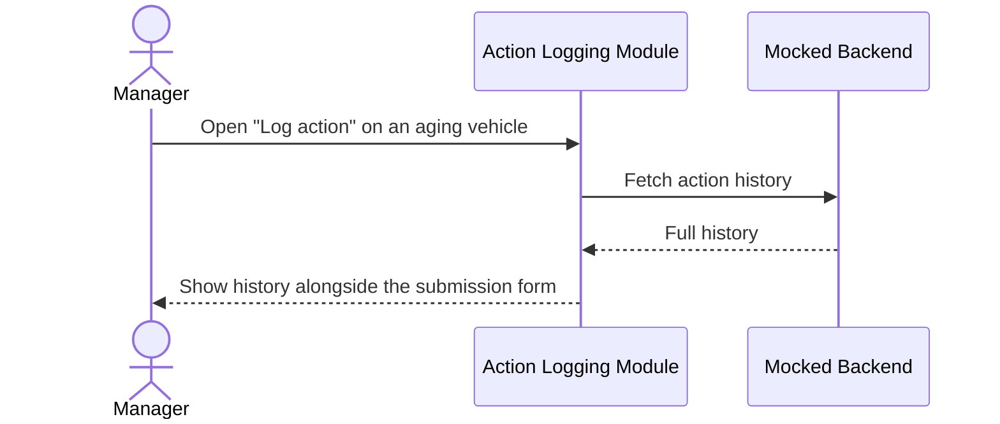
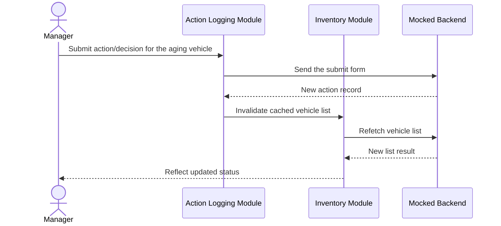

# System Design Document

---

## 1. Architecture Diagram



---

## 2. Component's Role

What each module does, its inputs and outputs, and which requirements it fulfills.

| Component | Responsibility | Interface (in / out) | Fulfilled Requirements |
|---|---|---|---|
| **Inventory Module** | Shows a page of vehicles; lets a manager filter, sort, and page through them | In: filter/sort/page selections. Out: matching vehicles | FR: display paginated inventory list; FR: filter by make/model/age server-side |
| **Aging Stock Module** | Flags vehicles over 90 days old and shows how many are aging | In: a vehicle or a count. Out: a badge or a count banner | FR: identify aging stock; FR: prominently display aging stock; FR: display aging count |
| **Action Logging Module** | Lets a manager log a status for an aging vehicle and view its history | In: a vehicle ID, existing action records. Out: a new action record | FR: persist status/action for aging vehicle (append-only); FR: display most recent action as current status |
| **Mocked Backend** | Serves vehicle data and stores logged actions; no real database, per the SRS | In: a request for vehicle or action data. Out: matching data | Constraint: backend mocked, no persistent database |

---

## 3. Domain Model

Conceptual entities only — no schema, keys, or storage detail, since the SRS mocks the backend. A physical schema is explicitly future work if a real backend is ever built.



Field-level definitions, with provenance (SRS citation or inference). Types excluded — see the future API Contract for wire-format types.

### 3.1 Vehicle

The SRS's "Vehicle Stock" concept. `intakeDate` alone drives the >90-day flag — not cached, to avoid staleness.

| Field | Meaning | Source |
|---|---|---|
| `vin` | Vehicle Identification Number — unique identifier for the vehicle | Automotive domain convention; not explicitly named in the SRS, but every entity requires an identifier |
| `make` | Vehicle manufacturer/brand | SRS FR: "filtering the inventory list by make, model, and age" |
| `model` | Vehicle model/product line | SRS FR: "filtering the inventory list by make, model, and age" |
| `intakeDate` | Date the vehicle entered dealership inventory; the sole source for computing "age" and the >90-day aging flag | Inferred — the SRS's "90 days" rule is uncomputable without a date field, though none is named |
| `currentStatus` | The vehicle's most recent logged action, recomputed by the mock on each read | SRS FR: "display most recent action as current status" |

### 3.2 AgingVehicleAction

The SRS's "Actionable Insights" concept. Modeled as an append-only, one-to-many log against `Vehicle`, not a single field.

| Field | Meaning | Source |
|---|---|---|
| `vehicleId` | References the `Vehicle` this action was logged against | Inferred — required by the "tied to an aging vehicle" relationship in the SRS's Actionable Insights definition |
| `action` | The manager-recorded status or proposed action (e.g. "Price Reduction Planned") | SRS Definition: Actionable Insights |
| `timestamp` | When the action was logged | SRS NFR: Logging (Observability) — "log key user actions... with timestamp" |

---

## 4. Data Flow

Three flows: view & filter inventory, view action history, and log an action.

### 4.1 View & Filter Inventory



### 4.2 View Action History



### 4.3 Log Aging-Vehicle Action



---

## 5. Solution Strategy: Chosen Technologies & Architecture Decisions

Structured per arc42 Section 4: each heavy decision recorded as Decision / Justification / Consequences (per Nygard's ADR format).

### 5.1 System-Level Architecture

**Decision:** Monolith.

**Justification:**
- SRS Product Perspective: no existing system to integrate with — microfrontend's core use case doesn't apply.
- SRS Assumption: Single-Dealership Scope — one bounded domain, not independently-owned teams.
- One developer, one deploy target — microfrontend's payoffs have no audience; costs are pure downside.

**Consequences:**
- Simpler build, single deploy artifact, no runtime composition layer.
- No independent deployability of features — accepted, given one developer and no competing release cadence.
- Revisit if the dashboard is embedded in multiple host apps, or ownership splits.

### 5.2 Application-Level Architecture

**Decision:** Feature-based architecture.

**Justification:**
- Maps onto the three Modules already established (§1.2, §2) — each becomes a self-contained folder.
- Avoids slicing the codebase two conflicting ways; module boundaries are already SRS-justified.
- Colocating each module's UI, state-access, and logic improves maintainability for a single developer working feature-by-feature.

**Consequences:**
- Each feature folder is self-contained and traceable to the SRS requirement it fulfills.
- Revisit if module boundaries in §2 change — folder structure must move in lockstep.
- Aging Stock and Action Logging are composed into Inventory from outside all three modules, not imported directly — Action Logging already depends on Inventory, so a direct import back would cycle.

---

### 5.3 Technology

Checked picks from `docs/STACKS.md`, justified here against this project's requirements.

#### Heavy Decisions

**Decision:** Next.js

**Justification:**
- Widest current React adoption; reviewer familiarity matters for an unknown evaluator.
- File-based routing and zero-config build tooling reduce setup time.
- SSR is used: initial fetch is server-side via `msw/node`; later interactivity runs client-side via `msw/browser`.

**Consequences:** Server/Client split is now load-bearing, not incidental; every module sits on one side. Requires dual-MSW setup.

---

**Decision:** Mock Service Worker (MSW) — dual setup: `msw/node` for the server-side initial fetch, `msw/browser` for all client-side calls

**Justification:**
- Satisfies the SRS constraint: backend must be mocked, not a real database.
- Intercepts at the network layer; each module's own DAL calls a real-shaped API.
- Server Components fetch in Node, not the browser; `msw/node` (via `instrumentation.ts`) intercepts that server-side fetch.
- Client-initiated calls (background polling, §4.1; action submission, §4.3) run in the browser and are intercepted by `msw/browser`, MSW's traditional setup.
- Both entry points share one handler array — no duplicated mock logic.

**Consequences:** Two MSW entry points instead of one; `instrumentation.ts` adds setup cost. No persistence beyond the session.

---

**Decision:** TanStack Query for server state; Zustand for UI-only client state

**Justification:**
- App state is dominated by server state, which TanStack Query is built for.
- Mutate-then-invalidate matches persisting actions (§4.3); `refetchInterval` covers background polling (§4.1).
- Client-only state is small; Zustand's minimal boilerplate is proportionate. Redux was rejected.
- Query keyed by page and filters; refetches automatically when either changes, matching paginated server-side queries.

**Consequences:** Two dependencies instead of one store, since server and client state differ (§4).

---

#### Other Technology Picks

| Technology | Why | Trade-off |
|---|---|---|
| TypeScript | Compile-time safety with no backend validation layer to catch errors otherwise; first-class support across React, TanStack Query, and MSW | Adds a build step — standard cost across the whole stack |
| Tailwind CSS | Responsive utilities directly serve the Adaptability NFR; fast to build without separate CSS files | Class-name verbosity in JSX |
| React Hook Form + Zod | Action Logging form (§4.3) needs runtime validation; Zod's schema-is-the-type avoids duplicating the `AgingVehicleAction` shape (§3.2) | Two dependencies serving this project's one form |
| lucide-react | Default icon set for shadcn/ui-style Tailwind components; tree-shakeable | Smaller icon selection than aggregator libraries |
| OpenAPI / Swagger spec | Self-documents the mock's two endpoints; forward-compatible if a real backend is built later; can generate TypeScript types | Extra tooling for very few endpoints |
| Jest | Required by the assessment brief's core-logic test-suite requirement; largest ecosystem, default in Next.js starters | Slower than Vitest for Vite projects — moot here since this runs on Next.js |
| Playwright | Cross-browser coverage exercises the Adaptability NFR (Chrome, Edge, Safari); auto-waiting reduces flaky tests | One more test dependency; Jest covers logic, this is the only cross-browser check |
| eslint-plugin-jsx-a11y | Serves the Learnability NFR via write-time accessibility feedback; zero runtime cost | Only catches JSX-detectable issues; `axe-core`/`jest-axe` remain a documented, not-yet-adopted option |
| dayjs | `intakeDate`/`timestamp` (§3) need computation and display formatting; small bundle, chainable API | Relies on plugins beyond core date handling |
| npm | Ships with Node.js — zero extra install for a reviewer; universal, most widely documented | Slower installs than pnpm — not meaningful at this dependency count |
| GitHub Actions | Native integration with GitHub, where the repo already lives; keeps a CD path open | YAML workflow syntax has a learning curve — one-time setup cost |
| Docker | Lets a reviewer run the app without a local Node/npm setup; documents the runtime environment declaratively | Requires Docker installed; README's plain local-run instructions remain the fallback |

---

## 6. Observability Strategy

Structured per the **Three Pillars of Observability** (logging, metrics, tracing). Browser DevTools serve as the observability backend for this frontend-only, mocked-backend scope.

### 6.1 Logs

A logging utility wraps calls at each key user action named by the SRS Logging NFR:

```ts
logEvent("inventory.viewed", { count: vehicles.length });
logEvent("inventory.filtered", { make, model, ageRange });
logEvent("aging_vehicle.action_logged", { vehicleId, action });
```

Emitted as structured JSON to `console.log`; the destination is swappable without touching call sites. **Fulfills:** SRS NFR — Logging (Observability).

### 6.2 Metrics

The SRS's Time Behaviour NFR (2 seconds per page, up to 500 vehicles) is instrumented via the Performance API:

```ts
markStart("inventory-render");
// ...render...
markEnd("inventory-render");
```

No dedicated metrics backend (Prometheus/Datadog) is introduced — unused weight at this scale. **Fulfills:** SRS NFR — Time Behaviour.

### 6.3 Traces

No distributed backend to trace across services. Reinterpreted: a correlation ID carried through the log entry and mock API call traces the interaction across module boundaries instead:

```ts
const correlationId = generateCorrelationId();
logEvent("aging_vehicle.action_logged", { vehicleId, action, correlationId });
postVehicleAction(vehicleId, action, { correlationId });
```

MSW's network-layer interception shows the request in DevTools with real timing — combined with the correlation ID, that's today's trace. **Fulfills:** assessment brief — "Build for the Future".

---

## 7. Note on Ambiguity

Per the assessment brief: *"If a requirement is unclear, please make a reasonable assumption and document it."* The following are assumptions made when interpreting the business idea and its requirements — independent of any particular technical implementation:

- **Domain Model isn't in the brief's checklist**, but was needed to describe the vehicle and action-logging concepts precisely. See §3.
- **Polling interval (30–60s) isn't specified by the SRS.** Assumed a balance of freshness against request volume for a manager keeping an eye on aging stock.
- **Availability NFR (99% uptime) was removed** — no real hosting SLA exists in this project's scope.
- **i18n is out of scope** — SRS names no locale requirement, despite the multinational parent organization.
- **90-day aging threshold isn't configurable** — kept fixed, matching the SRS's single stated rule rather than a per-dealership setting.
- **Real inventory scale is millions, not 500** — 500 is now the page size a manager sees at once; the full inventory is browsed a page at a time.
- **Page-number pagination chosen over infinite scroll** — fits spreadsheet-literate managers better (SRS User Characteristics).
- **Mock data uses a representative sample**, not literally millions, per the existing Mock Data Fidelity assumption.

---

## 8. GenAI Usage in the Design Phase

GenAI was used five activities, I reviewed, asked follow-up questions and confirmed:

1. **Software Requirement Specification** — Asked GenAI to propose an SRS structure, then filled in content through an iterative Q&A loop until every requirement was unambiguous, producing `docs/SRS_SUPPLY.md`.
2. **Technology stack shortlist** — Asked GenAI for a checklist of candidate stacks grouped by category (`docs/STACKS.md`), reviewed the pros/cons it listed for each, and made the final decision per category myself.
3. **System Design Document** — Asked GenAI to propose a structure for `SDD.md`, then worked through it section by section, correcting and clarifying content before accepting each one.
4. **Task decomposition** — Asked GenAI for epic/story templates, fed it the finished SDD and SRS, and had it break the work into stories (`docs/tasks/`) and define the execution loop (`docs/EXECUTION_LOOP.md`) governing how each story gets implemented.
5. **Frontend Design System** - Asked GenAI to generate a design system (`docs/DESIGN.md`) — colors, typography, spacing — since the UI had been in poor quality by default, applied in the mid-phase of the task implementation.