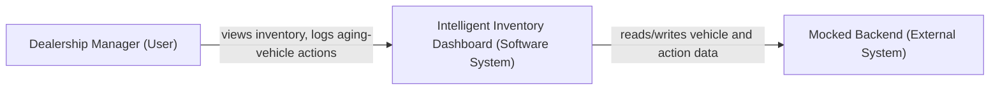
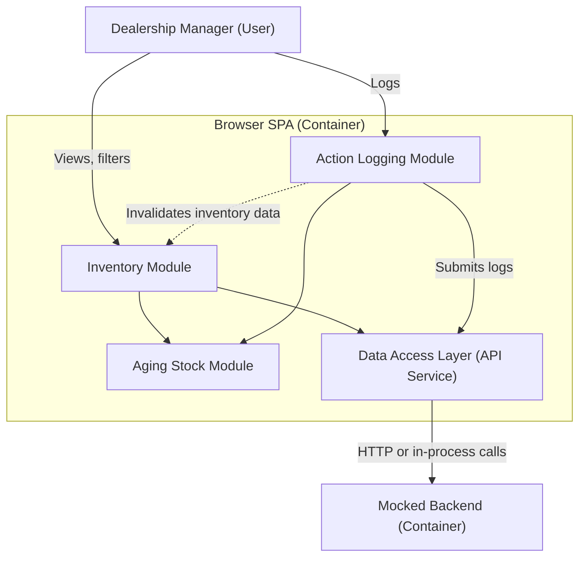
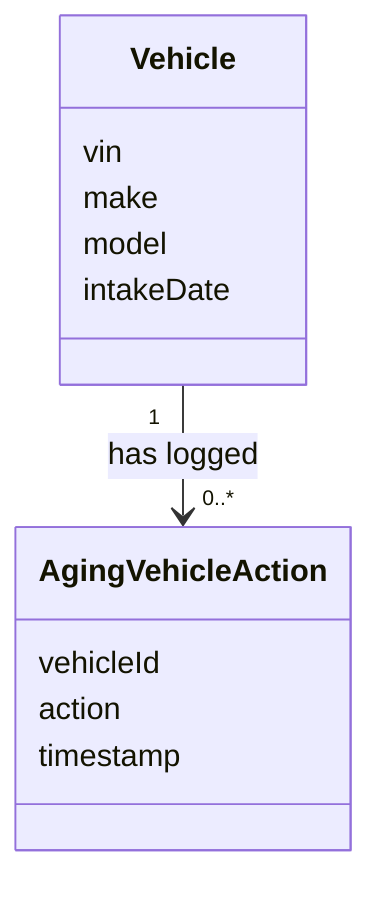
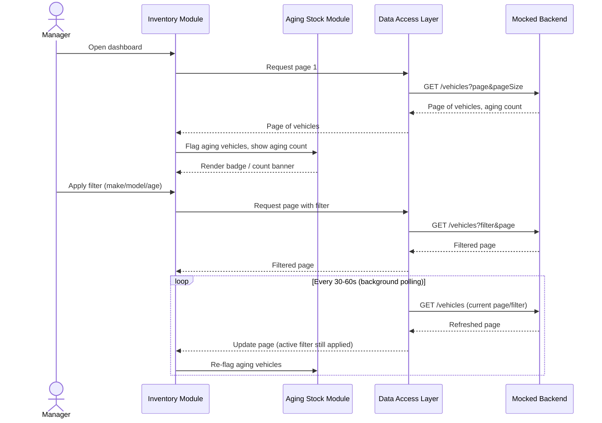
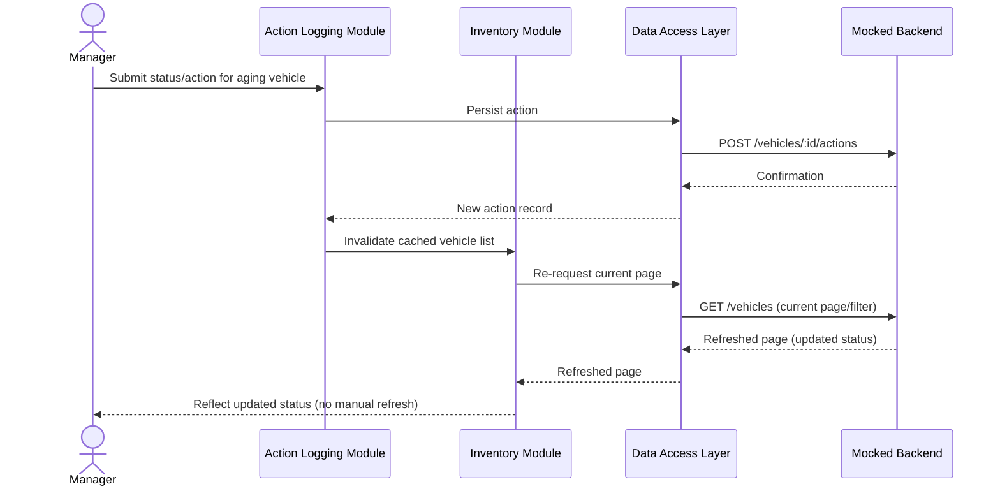

# System Design Document

---

## 1. Architecture Diagram

Structured per the C4 model: a System Context diagram (Level 1) plus a combined Container/Module diagram (Levels 2/3). A Code-level (Level 4) diagram is deliberately excluded, per the model's own "not recommended" guidance.

### 1.1 System Context



### 1.2 Container / Module



Rationale in [§5.1](#51-system-level-architecture).

---

## 2. Component's Role

Structured per arc42's Building Block View black-box template: Name, Responsibility, Interface, Fulfilled Requirements, Quality/Performance (where relevant). "Technology" is omitted here — not a formal field in either standard — recorded once, centrally, in Solution Strategy.

| Component | Responsibility | Interface (in / out) | Fulfilled Requirements |
|---|---|---|---|
| **Inventory Module** | Renders one page of vehicles and filters; filter/page changes trigger a new query | In: vehicles from DAL. Out: filter/sort/page params to DAL | FR: display paginated inventory list; FR: filter by make/model/age server-side |
| **Aging Stock Module** | Flags vehicles over 90 days; renders a server-computed aging count | In: Vehicle or count via props. Out: badge/banner UI; rule reused by IM, ALM | FR: identify aging stock; FR: prominently display aging stock; FR: display aging count |
| **Action Logging Module** | Lets a manager submit a status/action for an aging vehicle; shows history and current status | In: vehicle ID from IM, records from DAL. Out: new action; invalidates IM's cache | FR: persist status/action for aging vehicle (append-only); FR: display most recent action as current status |
| **Data Access Layer** | Abstracts calls to the mock for Inventory and Action Logging Modules | In: params from IM; read/write calls from ALM. Out: calls to Mock | Cross-cutting (Inventory, Action Logging — Aging Stock needs neither); enables swapping the mock for a real backend later |
| **Mocked Backend** | Serves vehicle inventory data and persists action records; no real DB, per SRS | In: paginated/filtered requests from DAL. Out: page of vehicle/action data | Constraint: backend mocked, no persistent database |

---

## 3. Domain Model

Conceptual entities only — no schema, keys, or storage detail, since the SRS mocks the backend. A physical schema is explicitly future work if a real backend is ever built.



Field-level definitions, with provenance (SRS citation or inference). Types excluded — see the future API Contract for wire-format types.

### 3.1 Vehicle

The SRS's "Vehicle Stock" concept. `intakeDate` alone drives the >90-day flag — not cached, to avoid staleness.

| Field | Meaning | Source |
|---|---|---|
| `vin` | Vehicle Identification Number — unique identifier for the vehicle | Automotive domain convention; not explicitly named in the SRS, but every entity requires an identifier |
| `make` | Vehicle manufacturer/brand | SRS FR: "filtering the inventory list by make, model, and age" |
| `model` | Vehicle model/product line | SRS FR: "filtering the inventory list by make, model, and age" |
| `intakeDate` | Date the vehicle entered dealership inventory; the sole source for computing "age" and the >90-day aging flag | Inferred — the SRS's "90 days" rule is uncomputable without a date field, though none is named |

### 3.2 AgingVehicleAction

The SRS's "Actionable Insights" concept. Modeled as an append-only, one-to-many log against `Vehicle`, not a single field.

| Field | Meaning | Source |
|---|---|---|
| `vehicleId` | References the `Vehicle` this action was logged against | Inferred — required by the "tied to an aging vehicle" relationship in the SRS's Actionable Insights definition |
| `action` | The manager-recorded status or proposed action (e.g. "Price Reduction Planned") | SRS Definition: Actionable Insights |
| `timestamp` | When the action was logged | SRS NFR: Logging (Observability) — "log key user actions... with timestamp" |

---

## 4. Data Flow

Two flows, each one sequence diagram: FRs describing one interaction cluster together; each `WHEN...SHALL...` requirement is its own flow.

### 4.1 View & Filter Inventory



### 4.2 Log Aging-Vehicle Action



---

## 5. Solution Strategy: Chosen Technologies & Architecture Decisions

Structured per arc42 Section 4: each heavy decision recorded as Decision / Justification / Consequences (per Nygard's ADR format).

### 5.1 System-Level Architecture

**Decision:** Monolith.

**Justification:**
- SRS Product Perspective: no existing system to integrate with — microfrontend's core use case doesn't apply.
- SRS Assumption: Single-Dealership Scope — one bounded domain, not independently-owned teams.
- One developer, one deploy target — microfrontend's payoffs have no audience; costs are pure downside.

**Consequences:**
- Simpler build, single deploy artifact, no runtime composition layer.
- No independent deployability of features — accepted, given one developer and no competing release cadence.
- Revisit if the dashboard is embedded in multiple host apps, or ownership splits.

### 5.2 Application-Level Architecture

**Decision:** Feature-based architecture.

**Justification:**
- Maps onto the three Modules already established (§1.2, §2) — each becomes a self-contained folder.
- Avoids slicing the codebase two conflicting ways; module boundaries are already SRS-justified.
- Colocating each module's UI, state-access, and logic improves maintainability for a single developer working feature-by-feature.

**Consequences:**
- Each feature folder is self-contained and traceable to the SRS requirement it fulfills.
- Revisit if module boundaries in §2 change — folder structure must move in lockstep.

---

### 5.3 Technology

Checked picks from `docs/STACKS.md`, justified here against this project's requirements.

#### Heavy Decisions

**Decision:** Next.js

**Justification:**
- Widest current React adoption; reviewer familiarity matters for an unknown evaluator.
- File-based routing and zero-config build tooling reduce setup time.
- SSR is used: initial fetch is server-side via `msw/node`; later interactivity runs client-side via `msw/browser`.

**Consequences:** Server/Client split is now load-bearing, not incidental; every module sits on one side. Requires dual-MSW setup.

---

**Decision:** Mock Service Worker (MSW) — dual setup: `msw/node` for the server-side initial fetch, `msw/browser` for all client-side calls

**Justification:**
- Satisfies the SRS constraint: backend must be mocked, not a real database.
- Intercepts at the network layer; Data Access Layer calls a real-shaped API.
- Server Components fetch in Node, not the browser; `msw/node` (via `instrumentation.ts`) intercepts that server-side fetch.
- Client-initiated calls (background polling, §4.1; action submission, §4.2) run in the browser and are intercepted by `msw/browser`, MSW's traditional setup.
- Both entry points share one handler array — no duplicated mock logic.

**Consequences:** Two MSW entry points instead of one; `instrumentation.ts` adds setup cost. No persistence beyond the session.

---

**Decision:** TanStack Query for server state; Zustand for UI-only client state

**Justification:**
- App state is dominated by server state, which TanStack Query is built for.
- Mutate-then-invalidate matches persisting actions (§4.2); `refetchInterval` covers background polling (§4.1).
- Client-only state is small; Zustand's minimal boilerplate is proportionate. Redux was rejected.
- Query keyed by page and filters; refetches automatically when either changes, matching paginated server-side queries.

**Consequences:** Two dependencies instead of one store, since server and client state differ (§4).

---

#### Other Technology Picks

| Technology | Why | Trade-off |
|---|---|---|
| TypeScript | Compile-time safety with no backend validation layer to catch errors otherwise; first-class support across React, TanStack Query, and MSW | Adds a build step — standard cost across the whole stack |
| Tailwind CSS | Responsive utilities directly serve the Adaptability NFR; fast to build without separate CSS files | Class-name verbosity in JSX |
| React Hook Form + Zod | Action Logging form (§4.2) needs runtime validation; Zod's schema-is-the-type avoids duplicating the `AgingVehicleAction` shape (§3.2) | Two dependencies serving this project's one form |
| lucide-react | Default icon set for shadcn/ui-style Tailwind components; tree-shakeable | Smaller icon selection than aggregator libraries |
| OpenAPI / Swagger spec | Self-documents the mock's two endpoints; forward-compatible if a real backend is built later; can generate TypeScript types | Extra tooling for very few endpoints |
| Jest | Required by the assessment brief's core-logic test-suite requirement; largest ecosystem, default in Next.js starters | Slower than Vitest for Vite projects — moot here since this runs on Next.js |
| Playwright | Cross-browser coverage exercises the Adaptability NFR (Chrome, Edge, Safari); auto-waiting reduces flaky tests | One more test dependency; Jest covers logic, this is the only cross-browser check |
| eslint-plugin-jsx-a11y | Serves the Learnability NFR via write-time accessibility feedback; zero runtime cost | Only catches JSX-detectable issues; `axe-core`/`jest-axe` remain a documented, not-yet-adopted option (§14) |
| dayjs | `intakeDate`/`timestamp` (§3) need computation and display formatting; small bundle, chainable API | Relies on plugins beyond core date handling |
| npm | Ships with Node.js — zero extra install for a reviewer; universal, most widely documented | Slower installs than pnpm — not meaningful at this dependency count |
| GitHub Actions | Native integration with GitHub, where the repo already lives; keeps a CD path open | YAML workflow syntax has a learning curve — one-time setup cost |
| Docker | Lets a reviewer run the app without a local Node/npm setup; documents the runtime environment declaratively | Requires Docker installed; README's plain local-run instructions remain the fallback |

---

## 6. Observability Strategy

Structured per the **Three Pillars of Observability** (logging, metrics, tracing). Browser DevTools serve as the observability backend for this frontend-only, mocked-backend scope.

### 6.1 Logs

A logging utility wraps calls at each key user action named by the SRS Logging NFR:

```ts
logEvent("inventory.viewed", { count: vehicles.length });
logEvent("inventory.filtered", { make, model, ageRange });
logEvent("aging_vehicle.action_logged", { vehicleId, action });
```

Emitted as structured JSON to `console.log`; the destination is swappable without touching call sites. **Fulfills:** SRS NFR — Logging (Observability).

### 6.2 Metrics

The SRS's Time Behaviour NFR (2 seconds per page, up to 500 vehicles) is instrumented via the Performance API:

```ts
performance.mark("inventory-render-start");
// ...render...
performance.mark("inventory-render-end");
performance.measure("inventory-render", "inventory-render-start", "inventory-render-end");
```

No dedicated metrics backend (Prometheus/Datadog) is introduced — unused weight at this scale. **Fulfills:** SRS NFR — Time Behaviour.

### 6.3 Traces

No distributed backend to trace across services. Reinterpreted: a correlation ID carried through the log entry and mock API call traces the interaction across module boundaries instead:

```ts
const correlationId = crypto.randomUUID();
logEvent("aging_vehicle.action_logged", { vehicleId, action, correlationId });
dataAccessLayer.postAction(vehicleId, action, { headers: { "X-Correlation-Id": correlationId } });
```

MSW's network-layer interception shows the request in DevTools with real timing — combined with the correlation ID, that's today's trace. **Fulfills:** assessment brief — "Build for the Future".

---

## 7. Note on Ambiguity

Per the assessment brief: *"If a requirement is unclear, please make a reasonable assumption and document it."* The following are **design-level** ambiguities that arose only once architectural choices were being made:

- **Tracing doesn't fit a monolithic SPA.** Reinterpreted as correlation-ID tracking across module boundaries in one browser process. See §6.3.
- **C4 diagram depth wasn't specified.** Assumed Context + Container/Module suffices; Code-level excluded per C4's own guidance. See §1.
- **Domain Model isn't in the brief's checklist**, but was needed to implement the mocked backend. See §3.
- **Next.js SSR is actively used** — initial fetch runs server-side via `msw/node`; rest stays client-side via `msw/browser`. See §5.3.
- **Polling interval (30–60s) isn't specified by the SRS.** Assumed a balance of freshness against request volume. See §4.1.
- **Availability NFR (99% uptime) was removed** — no real hosting SLA exists in this project's scope.
- **i18n is out of scope** — SRS names no locale requirement, despite the multinational parent organization.
- **arc42's stakeholder/quality-goal table wasn't produced** — Solution Strategy anchors to SRS constraints directly instead.
- **90-day aging threshold isn't configurable** — persisting a setting would conflict with the no-database constraint.
- **Real inventory scale is millions, not 500** — 500 is now page size; pagination and server-side filtering are mandatory.
- **Page-number pagination chosen over infinite scroll** — fits spreadsheet-literate managers better (SRS User Characteristics).
- **Offset-based pagination chosen over cursor-based**, for simplicity against a mocked backend; deferred as future work.
- **Mock fixtures use a representative sample**, not literally millions, per the existing Mock Data Fidelity assumption.

---

## 8. GenAI Usage in the Design Phase

*To be written by the author.*
